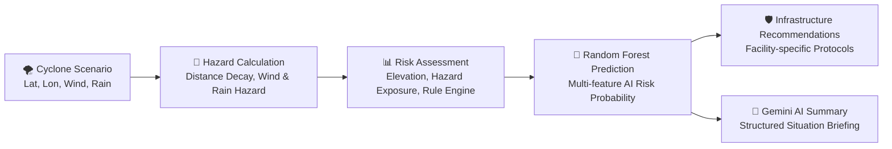

# CycloneGuard AI — Predictive Cyclone Impact & Infrastructure Vulnerability Platform

An AI-driven decision-support platform that forecasts cyclone impact severity, assesses critical infrastructure vulnerabilities, and generates real-time emergency response intelligence.

---

## 📌 Problem Statement

Tropical cyclones pose severe threats to coastal regions, causing widespread destruction from extreme gale-force winds, torrential rainfall, storm surges, and inland flooding. During an unfolding cyclone emergency, disaster management authorities face critical challenges:

* **Hospitals:** Vulnerable to severe power grid collapse, flooding of ground-floor emergency facilities, and road blockages cutting off ambulance access.
* **Shelters:** Risk being overwhelmed, structurally compromised, or rendered inaccessible if situated in low-elevation flood zones.
* **Roads & Bridges:** Susceptible to flooding, erosion, and debris blockages, severing evacuation corridors and supply lines.
* **Power Stations & Grids:** Extreme wind speeds and water intrusion lead to widespread blackouts, disabling communications and emergency services.

Traditional disaster response often relies on broad regional warnings rather than asset-level vulnerability intelligence. Early, localized infrastructure risk assessment is essential to prioritize emergency crew deployment, stage backup generators, secure critical facilities, and protect vulnerable communities before landfall.

---

## 💡 Solution

**CycloneGuard AI** bridges the gap between meteorological forecasts and localized infrastructure protection:

* **What-If Cyclone Scenario Simulation:** Allows emergency managers and planners to simulate cyclone paths, coordinates, maximum sustained wind speeds, and rainfall rates.
* **Hazard & Exposure Analysis:** Computes localized wind hazard, rainfall intensity, and elevation-based flood vulnerability for each asset.
* **Machine Learning Risk Prediction:** Employs a trained **Random Forest** classification model to evaluate multidimensional features and predict High-Risk probabilities for critical assets.
* **Interactive Geospatial Visualization:** Visualizes cyclone centers, wind radii, asset locations, and color-coded risk markers on an interactive Leaflet/Folium map.
* **Actionable Emergency Recommendations:** Delivers infrastructure-specific, prioritized preparedness protocols for hospitals, shelters, roads, and power stations.
* **Gemini AI Emergency Briefing:** Leverages Google's **Gemini API** (`gemini-3.8-flash`) to synthesize complex scenario analytics into structured, human-readable emergency situation briefings.

---

## ✨ Key Features

* **Interactive Cyclone Map:** Leaflet/Folium map rendering cyclone center, buffer radii, and color-coded infrastructure markers (Red: High Risk, Orange: Medium Risk, Green: Low Risk).
* **Infrastructure Vulnerability Assessment:** Granular assessment covering hospitals, evacuation shelters, primary roadways, and power stations.
* **Wind & Rainfall Hazard Modeling:** Distance-decay wind speed models and rainfall hazard thresholds.
* **Flood & Elevation Risk:** Coastal elevation profiling to flag flash-flood and storm-surge exposure.
* **Random Forest AI Prediction:** Pre-trained machine learning model predicting high-risk failure likelihood per asset.
* **Interactive What-If Simulation:** Dynamic sidebar sliders to model diverse cyclone scenarios and test resilience under varying storm intensities.
* **Key Risk Metrics:** Instant summary cards displaying total assessed assets, high-risk assets, and high-risk hospitals.
* **Early-Warning Recommendations:** Operational checklists and mitigation actions tailored to asset types.
* **Gemini AI Emergency Situation Summary:** Natural-language AI executive briefing detailing overall situation, most vulnerable infrastructure, critical attention areas, and preparedness actions.

---

## 🛠️ Technology Stack

| Layer | Technology |
| :--- | :--- |
| **Language** | Python (3.11+) |
| **Web Framework** | Streamlit |
| **Mapping & Geospatial** | Folium, Streamlit-Folium |
| **Data Processing** | Pandas, NumPy |
| **Machine Learning** | Scikit-learn, Joblib |
| **Generative AI** | Google Gemini API (`google-genai` SDK, `gemini-3.8-flash`) |

---

## 📂 Project Structure

```text
cycloneguard-ai/
├── .streamlit/
│   └── secrets.toml         # Streamlit secrets configuration (API keys)
├── data/                    # Data directory for asset catalogues and inputs
├── notebooks/
│   ├── train_model.py       # Model training script
│   └── train_risk_model.ipynb # Model experimentation and training notebook
├── .env                     # Local environment variables (optional)
├── .gitignore               # Git ignore rules
├── app.py                   # Main CycloneGuard Streamlit application
├── recommendations.py       # Domain-specific mitigation and advisory logic
├── requirements.txt         # Project Python dependencies
├── risk_model.pkl           # Pre-trained Random Forest classifier
└── README.md                # Project documentation
```

---

## 🚀 How to Run

### 1. Clone the Repository
```bash
git clone https://github.com/SirigangaBS/cycloneguard-ai.git
cd cycloneguard-ai
```

### 2. Create and Activate a Virtual Environment
```bash
# Windows (PowerShell)
python -m venv venv
.\venv\Scripts\Activate.ps1

# Linux / macOS
python3 -m venv venv
source venv/bin/activate
```

### 3. Install Dependencies
```bash
pip install -r requirements.txt
pip install google-genai
```

### 4. Configure Gemini API Key
Choose one of the secure methods below to provide your Gemini API key (see [Gemini API Setup](#-gemini-api-setup)):
* Add to `.streamlit/secrets.toml`:
  ```toml
  GEMINI_API_KEY = "your_actual_gemini_api_key"
  ```
* Or add to `.env`:
  ```bash
  GEMINI_API_KEY=your_actual_gemini_api_key
  ```
* Or enter it directly in the app's sidebar during execution.

### 5. Launch the Application
```bash
streamlit run app.py
```
The application will open in your default browser at `http://localhost:8501`.

---

## 🔑 Gemini API Setup

CycloneGuard AI utilizes the **Google GenAI Python SDK (`google-genai`)** with the high-performance **`gemini-3.8-flash`** model.

1. Obtain a free API key from [Google AI Studio](https://aistudio.google.com/app/apikey).
2. Configure the key securely using any of these options:
   * **Streamlit Secrets (Recommended):** Add `GEMINI_API_KEY = "your_key"` to `.streamlit/secrets.toml`.
   * **Environment Variable:** Set `GEMINI_API_KEY` in your system environment or in a local `.env` file.
   * **Sidebar Input:** Enter the key in the password-masked sidebar input field within the UI.

> [!NOTE]
> Never commit actual API keys or credentials to version control. The repository includes `.env` and `.streamlit/secrets.toml` entries in `.gitignore`.

> [!TIP]
> **Graceful Degradation:** If no API key is provided, or if the upstream API encounters a rate limit (HTTP 429) or high demand spike (HTTP 503), CycloneGuard automatically generates a simulated situation summary based on calculated metrics to ensure uninterrupted emergency operations.

---

## 🔄 AI / Risk Pipeline



1. **Scenario Input:** User specifies cyclone coordinates, maximum sustained wind speed (km/h), and rainfall rate (mm/h).
2. **Hazard Calculation:** The platform calculates the distance from each infrastructure asset to the storm center and determines local wind speed and flood hazard based on elevation and rainfall.
3. **Multi-Feature Assembly:** Features including wind speed, rainfall, elevation, distance to cyclone, asset type one-hot encodings, importance weight, and rule-based risk scores are computed.
4. **Random Forest Inference:** The pre-trained Scikit-Learn `RandomForestClassifier` calculates the probability of each asset belonging to the High Risk class.
5. **Actionable Recommendations:** Rule-based recommendation engine (`recommendations.py`) maps risk levels and asset types to actionable mitigation guidelines.
6. **Gemini Situation Summary:** Aggregated scenario metrics, hospital counts, and top critical assets are synthesized by Gemini into a 4-part emergency briefing (Overall Situation, Most Vulnerable Infrastructure, Key Areas Requiring Attention, Preparedness Considerations).

---

## 🌐 Google Technology Integration

CycloneGuard AI integrates Google's cutting-edge AI stack:
* **Official Google GenAI SDK:** Implements `from google import genai` via the new `google-genai` Python library.
* **Model:** Calls `gemini-3.8-flash` for low-latency, accurate natural-language reasoning.
* **Emergency Briefing Synthesis:** Converts raw numerical forecasts (probabilities, coordinates, asset counts) into concise, standardized operational summaries for first responders and decision-makers.

---

## ⚠️ Important Note

> **Disclaimer:** CycloneGuard AI is a hackathon prototype developed for educational, research, and demonstration purposes. Model predictions, hazard estimates, and operational recommendations are intended as decision-support insights and do **not** replace official meteorological bulletins, evacuation orders, or directives from authorized disaster management authorities (e.g., IMD, NDMA).

---

## 🔮 Future Scope

* **Live Weather API Integration:** Connect to real-time meteorological feeds (e.g., IMD, NOAA, ECMWF) for live cyclone tracking.
* **Earth Observation & Geospatial Layers:** Integrate satellite imagery, storm surge bathymetry, and high-resolution digital elevation models (DEM).
* **Historical Cyclone Training:** Train ML models on multi-decadal historical cyclone landfall datasets to enhance predictive accuracy.
* **Optimal Evacuation Routing:** Incorporate graph-based route optimization algorithms to navigate emergency crews around flooded road networks.
* **Production Cloud Deployment:** Containerize with Docker and deploy to Google Cloud Run or Kubernetes for scalable disaster-response operations.
